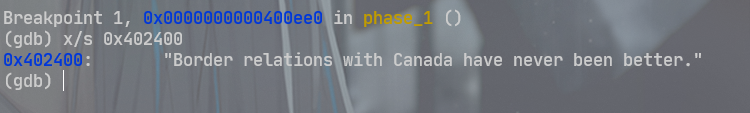
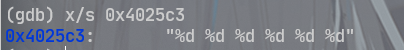
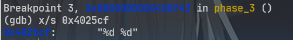
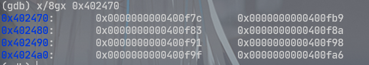
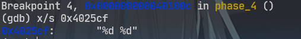
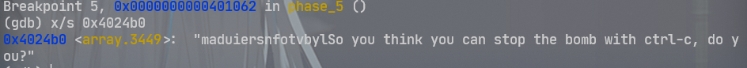
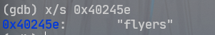
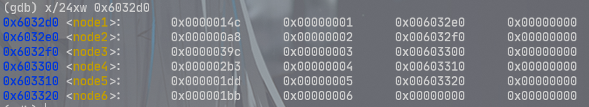

## CSAPP Lab2-bomb

### 前置知识

- x86-64汇编指令
- x86-64各寄存器的功能
- 循环、条件判断、跳转表、数组索引等的汇编实现方式
- 栈区空间分配方法
- c 语言基础知识

### 环境准备

只需要 gdb 和 objdump 两个软件即可，基本可以说是 linux 系统自带了

cgdb 是一个视觉效果更好的 gdb，可以大致看成一个在 vim 里的 gdb 吧，可以在 gdb 调试时同时看到代码，实验体验更好

在实验文件夹下我准备了一个安装脚本 installCgdb.sh，运行即可一键安装 cgdb

实验开始之前，先进行反汇编操作 `objdump -d bomb > bomb.asm` 得到炸弹程序的汇编代码

### 开始实验

**main**

进行解题之前，我们需要先弄清楚整个程序大的运行逻辑，以及是怎么进入的不同 phase 的

在 c 语言中，函数是从 main 开始执行的，我们直接定位到 main 函数段进行简单的分析

```assembly
0000000000400da0 <main>:
  400da0:	53                   	push   %rbx
  400da1:	83 ff 01             	cmp    $0x1,%edi
  400da4:	75 10                	jne    400db6 <main+0x16>
  400da6:	48 8b 05 9b 29 20 00 	mov    0x20299b(%rip),%rax        # 603748 <stdin@@GLIBC_2.2.5>
  400dad:	48 89 05 b4 29 20 00 	mov    %rax,0x2029b4(%rip)        # 603768 <infile>
  400db4:	eb 63                	jmp    400e19 <main+0x79>
  400db6:	48 89 f3             	mov    %rsi,%rbx
  400db9:	83 ff 02             	cmp    $0x2,%edi
  400dbc:	75 3a                	jne    400df8 <main+0x58>
  400dbe:	48 8b 7e 08          	mov    0x8(%rsi),%rdi
  400dc2:	be b4 22 40 00       	mov    $0x4022b4,%esi
  400dc7:	e8 44 fe ff ff       	callq  400c10 <fopen@plt>
  400dcc:	48 89 05 95 29 20 00 	mov    %rax,0x202995(%rip)        # 603768 <infile>
  400dd3:	48 85 c0             	test   %rax,%rax
  400dd6:	75 41                	jne    400e19 <main+0x79>
  400dd8:	48 8b 4b 08          	mov    0x8(%rbx),%rcx
  400ddc:	48 8b 13             	mov    (%rbx),%rdx
  400ddf:	be b6 22 40 00       	mov    $0x4022b6,%esi
  400de4:	bf 01 00 00 00       	mov    $0x1,%edi
  400de9:	e8 12 fe ff ff       	callq  400c00 <__printf_chk@plt>
  400dee:	bf 08 00 00 00       	mov    $0x8,%edi
  400df3:	e8 28 fe ff ff       	callq  400c20 <exit@plt>
  400df8:	48 8b 16             	mov    (%rsi),%rdx
  400dfb:	be d3 22 40 00       	mov    $0x4022d3,%esi
  400e00:	bf 01 00 00 00       	mov    $0x1,%edi
  400e05:	b8 00 00 00 00       	mov    $0x0,%eax
  400e0a:	e8 f1 fd ff ff       	callq  400c00 <__printf_chk@plt>
  400e0f:	bf 08 00 00 00       	mov    $0x8,%edi
  400e14:	e8 07 fe ff ff       	callq  400c20 <exit@plt>
  400e19:	e8 84 05 00 00       	callq  4013a2 <initialize_bomb>
  400e1e:	bf 38 23 40 00       	mov    $0x402338,%edi
  400e23:	e8 e8 fc ff ff       	callq  400b10 <puts@plt>
  400e28:	bf 78 23 40 00       	mov    $0x402378,%edi
  400e2d:	e8 de fc ff ff       	callq  400b10 <puts@plt>
  400e32:	e8 67 06 00 00       	callq  40149e <read_line> ; 读取 phase_1 输入
  400e37:	48 89 c7             	mov    %rax,%rdi          ; 作为 phase_1 参数
  400e3a:	e8 a1 00 00 00       	callq  400ee0 <phase_1>   ; 调用 phase_1 判断输入是否正确
  400e3f:	e8 80 07 00 00       	callq  4015c4 <phase_defused> ; 成功通过函数 phase_1 则拆除炸弹
  400e44:	bf a8 23 40 00       	mov    $0x4023a8,%edi     ; 作为打印的参数
  400e49:	e8 c2 fc ff ff       	callq  400b10 <puts@plt>  ; 打印输入通过这一阶段的信息
  400e4e:	e8 4b 06 00 00       	callq  40149e <read_line> ; 后面也是循环上述过程，不再一一注释
  400e53:	48 89 c7             	mov    %rax,%rdi          ; ...
  400e56:	e8 a1 00 00 00       	callq  400efc <phase_2>
  400e5b:	e8 64 07 00 00       	callq  4015c4 <phase_defused>
  400e60:	bf ed 22 40 00       	mov    $0x4022ed,%edi
  400e65:	e8 a6 fc ff ff       	callq  400b10 <puts@plt>
  400e6a:	e8 2f 06 00 00       	callq  40149e <read_line>
  400e6f:	48 89 c7             	mov    %rax,%rdi
  400e72:	e8 cc 00 00 00       	callq  400f43 <phase_3>
  400e77:	e8 48 07 00 00       	callq  4015c4 <phase_defused>
  400e7c:	bf 0b 23 40 00       	mov    $0x40230b,%edi
  400e81:	e8 8a fc ff ff       	callq  400b10 <puts@plt>
  400e86:	e8 13 06 00 00       	callq  40149e <read_line>
  400e8b:	48 89 c7             	mov    %rax,%rdi
  400e8e:	e8 79 01 00 00       	callq  40100c <phase_4>
  400e93:	e8 2c 07 00 00       	callq  4015c4 <phase_defused>
  400e98:	bf d8 23 40 00       	mov    $0x4023d8,%edi
  400e9d:	e8 6e fc ff ff       	callq  400b10 <puts@plt>
  400ea2:	e8 f7 05 00 00       	callq  40149e <read_line>
  400ea7:	48 89 c7             	mov    %rax,%rdi
  400eaa:	e8 b3 01 00 00       	callq  401062 <phase_5>
  400eaf:	e8 10 07 00 00       	callq  4015c4 <phase_defused>
  400eb4:	bf 1a 23 40 00       	mov    $0x40231a,%edi
  400eb9:	e8 52 fc ff ff       	callq  400b10 <puts@plt>
  400ebe:	e8 db 05 00 00       	callq  40149e <read_line>
  400ec3:	48 89 c7             	mov    %rax,%rdi
  400ec6:	e8 29 02 00 00       	callq  4010f4 <phase_6>
  400ecb:	e8 f4 06 00 00       	callq  4015c4 <phase_defused>
  400ed0:	b8 00 00 00 00       	mov    $0x0,%eax
  400ed5:	5b                   	pop    %rbx
  400ed6:	c3                   	retq   
```

整个程序分成六个阶段，每个阶段就是一个 phase 函数，进入每个阶段前从键盘读取输入并作为函数的输入。如果 phase 函数正常退出，就会执行 phase_defused 函数，从命名来看是拆除炸弹。也就是说如果输入错误，程序会在 phase 函数中触发炸弹。解决每个 phase 就得去到每个 phase 函数那里分析汇编代码了。

其实实验也提供了主干部分的 c 语言代码，从那里也能大致得出这些内容


**phase_1**

设置好断点 `break phase_1` 让函数在进入 phase_1 时停住

```assembly
0000000000400ee0 <phase_1>:
  400ee0:	48 83 ec 08          	sub    $0x8,%rsp
  400ee4:	be 00 24 40 00       	mov    $0x402400,%esi             ; 设置第二参数
  400ee9:	e8 4a 04 00 00       	callq  401338 <strings_not_equal> ; 比较两参数字符串是否一致
  400eee:	85 c0                	test   %eax,%eax
  400ef0:	74 05                	je     400ef7 <phase_1+0x17>      ; 一致则跳转退出
  400ef2:	e8 43 05 00 00       	callq  40143a <explode_bomb>      ; 不一致则触发炸弹
  400ef7:	48 83 c4 08          	add    $0x8,%rsp
  400efb:	c3                   	retq
```

发现 phase_1 中调用 strings_not_equal 函数 ，看名字意思是判断输入的两个字符串是否相等。

在调用该函数前，寄存器 %rdi 没有发生改变，所以 strings_not_equal 的第一个参数就是 phase_1 的参数，即键盘输入。`mov $0x402400,%esi` 指令在准备第二个参数，参数位于 `$0x402400` 这个地址，所以答案显而易见就在这个位置，直接对这个地址里的内容进行打印就看到答案了。



这道属于是熟悉一下环境，白给一下。


**phase_2**

同样是断点，然后分析汇编代码

一进函数就调用了一个 read_six_numbers 函数，先去分析一下这个函数的作用

```assembly
000000000040145c <read_six_numbers>:
  40145c:	48 83 ec 18          	sub    $0x18,%rsp
  401460:	48 89 f2             	mov    %rsi,%rdx        ; 第 1 个整数
  401463:	48 8d 4e 04          	lea    0x4(%rsi),%rcx   ; 第 2 个整数
  401467:	48 8d 46 14          	lea    0x14(%rsi),%rax  ; 第 6 个整数
  40146b:	48 89 44 24 08       	mov    %rax,0x8(%rsp)
  401470:	48 8d 46 10          	lea    0x10(%rsi),%rax  ; 第 5 个整数
  401474:	48 89 04 24          	mov    %rax,(%rsp)
  401478:	4c 8d 4e 0c          	lea    0xc(%rsi),%r9    ; 第 4 个整数
  40147c:	4c 8d 46 08          	lea    0x8(%rsi),%r8    ; 第 3 个整数
  401480:	be c3 25 40 00       	mov    $0x4025c3,%esi   ; 字符串解析模式
  401485:	b8 00 00 00 00       	mov    $0x0,%eax
  40148a:	e8 61 f7 ff ff       	callq  400bf0 <__isoc99_sscanf@plt>
  40148f:	83 f8 05             	cmp    $0x5,%eax        ; 输入不够 6 个整数就爆炸
  401492:	7f 05                	jg     401499 <read_six_numbers+0x3d>
  401494:	e8 a1 ff ff ff       	callq  40143a <explode_bomb>
  401499:	48 83 c4 18          	add    $0x18,%rsp
  40149d:	c3                   	retq   
```

read_six_numbers 可以看出作用就是从键盘的输入中（phase_2 的参数）读取出六个十进制整数

sscanf 函数第一个参数是要解析的字符串，第二个参数是解析的模式，从第三个参数开始是解析的目的变量。read_six_numbers 要解析出六个整数，所以 sscanf 应当有 8 个参数。

指令 `mov $0x4025c3,%esi` 这步是在准备 sscanf 的第二个参数，打印一下地址的内容可以看到需要我们输入的字符串的格式信息



在 read_six_numbers 中得到的最重要的信息是解析完的六个整数在内存中的什么位置，read_six_numbers 中的 %rsi 等于 phase_2 中的 %rsp，所以在 phase_2 中，解析完的整数变量就按顺序放在栈里

- 1 st：%rsp
- 2 st：0x4(%rsp)
- 3 st：0x8(%rsp)
- 4 st：0xc(%rsp)
- 5 st：0x10(%rsp)
- 6 st：0x14(%rsp)

回到 phase_2 继续分析，

```assembly
0000000000400efc <phase_2>:
  400efc:	55                   	push   %rbp
  400efd:	53                   	push   %rbx
  400efe:	48 83 ec 28          	sub    $0x28,%rsp
  400f02:	48 89 e6             	mov    %rsp,%rsi
  400f05:	e8 52 05 00 00       	callq  40145c <read_six_numbers>
  400f0a:	83 3c 24 01          	cmpl   $0x1,(%rsp)            ; 1st 和 1 比较
  400f0e:	74 20                	je     400f30 <phase_2+0x34>
  400f10:	e8 25 05 00 00       	callq  40143a <explode_bomb>
  400f15:	eb 19                	jmp    400f30 <phase_2+0x34>
  400f17:	8b 43 fc             	mov    -0x4(%rbx),%eax        ; eax 存放上一参数
  400f1a:	01 c0                	add    %eax,%eax              ; eax 翻倍
  400f1c:	39 03                	cmp    %eax,(%rbx)            ; 判断 eax 和 rbx 指向的参数是否相等
  400f1e:	74 05                	je     400f25 <phase_2+0x29>
  400f20:	e8 15 05 00 00       	callq  40143a <explode_bomb>  ; 不相等就引爆
  400f25:	48 83 c3 04          	add    $0x4,%rbx              ; rbx 指向下一个参数
  400f29:	48 39 eb             	cmp    %rbp,%rbx              ; 判断是否超过循环边界
  400f2c:	75 e9                	jne    400f17 <phase_2+0x1b>  ; 继续循环
  400f2e:	eb 0c                	jmp    400f3c <phase_2+0x40>  ; 退出循环
  400f30:	48 8d 5c 24 04       	lea    0x4(%rsp),%rbx       ; rbx 指向 2st
  400f35:	48 8d 6c 24 18       	lea    0x18(%rsp),%rbp      ; rbp 指向 6st(循环边界)
  400f3a:	eb db                	jmp    400f17 <phase_2+0x1b>
  400f3c:	48 83 c4 28          	add    $0x28,%rsp
  400f40:	5b                   	pop    %rbx
  400f41:	5d                   	pop    %rbp
  400f42:	c3                   	retq 
```

首先判断了第一个参数是不是 1，不是就引爆。

后续进入一个循环，下一个参数必须是上一个参数的两倍，如果不是就引爆炸弹。

所以结果是个等比数列：1 2 4 8 16 32

这个题目考察的点主要是函数传参的方式以及普通循环。


**phase_3**

```assembly
0000000000400f43 <phase_3>:
  400f43:	48 83 ec 18          	sub    $0x18,%rsp
  400f47:	48 8d 4c 24 0c       	lea    0xc(%rsp),%rcx   ; 第 2 个整数
  400f4c:	48 8d 54 24 08       	lea    0x8(%rsp),%rdx   ; 第 1 个整数
  400f51:	be cf 25 40 00       	mov    $0x4025cf,%esi   ; 输入模式
  400f56:	b8 00 00 00 00       	mov    $0x0,%eax
  400f5b:	e8 90 fc ff ff       	callq  400bf0 <__isoc99_sscanf@plt> ; 解析输入内容
  400f60:	83 f8 01             	cmp    $0x1,%eax        ; 判断输入个数
  400f63:	7f 05                	jg     400f6a <phase_3+0x27>
  400f65:	e8 d0 04 00 00       	callq  40143a <explode_bomb>
  400f6a:	83 7c 24 08 07       	cmpl   $0x7,0x8(%rsp)   ; 判断 1st 是否超过 7
  400f6f:	77 3c                	ja     400fad <phase_3+0x6a>  ; 超过 7 跳去引爆炸弹
  400f71:	8b 44 24 08          	mov    0x8(%rsp),%eax
  400f75:	ff 24 c5 70 24 40 00 	jmpq   *0x402470(,%rax,8) ; 跳转表
  400f7c:	b8 cf 00 00 00       	mov    $0xcf,%eax
  400f81:	eb 3b                	jmp    400fbe <phase_3+0x7b>
  400f83:	b8 c3 02 00 00       	mov    $0x2c3,%eax
  400f88:	eb 34                	jmp    400fbe <phase_3+0x7b>
  400f8a:	b8 00 01 00 00       	mov    $0x100,%eax
  400f8f:	eb 2d                	jmp    400fbe <phase_3+0x7b>
  400f91:	b8 85 01 00 00       	mov    $0x185,%eax
  400f96:	eb 26                	jmp    400fbe <phase_3+0x7b>
  400f98:	b8 ce 00 00 00       	mov    $0xce,%eax
  400f9d:	eb 1f                	jmp    400fbe <phase_3+0x7b>
  400f9f:	b8 aa 02 00 00       	mov    $0x2aa,%eax
  400fa4:	eb 18                	jmp    400fbe <phase_3+0x7b>
  400fa6:	b8 47 01 00 00       	mov    $0x147,%eax
  400fab:	eb 11                	jmp    400fbe <phase_3+0x7b>
  400fad:	e8 88 04 00 00       	callq  40143a <explode_bomb>
  400fb2:	b8 00 00 00 00       	mov    $0x0,%eax
  400fb7:	eb 05                	jmp    400fbe <phase_3+0x7b>
  400fb9:	b8 37 01 00 00       	mov    $0x137,%eax        ; 1st == 1 的话跳到这里
  400fbe:	3b 44 24 0c          	cmp    0xc(%rsp),%eax     ; 判断 0x137 和 2st 是否相等
  400fc2:	74 05                	je     400fc9 <phase_3+0x86>  ; 相等就退出函数
  400fc4:	e8 71 04 00 00       	callq  40143a <explode_bomb>  ; 不相等就爆炸  
  400fc9:	48 83 c4 18          	add    $0x18,%rsp
  400fcd:	c3                   	retq
```

一进来就看到有个 sscanf 的函数调用，依据上一题的经验，我们知道输入模式可以从这里获得。瞄准 `mov $0x4025cf,%esi` 打印一下信息，就知道了这题的答案是两个整数。



`jmpq *0x402470(,%rax,8)` 语句可以推理出来应该是个跳转表，所以这个题是个 switch 语句，%rax 中的内容就是键盘输入的第一个整数，可以打印一下跳转表的内容查看一下不同的输入会去到什么地方。前面判断了输入要小于等于7，所以分支应该有8条，打印八个字节的内容。



小于 7 的数我就随便选个 1 了，查阅跳跃表，他会跳到 `0x0000000000400fb9` ，第一个输入不同导致跳转的位置不同，后续也会影响第二个输入的对错。

跳转后的逻辑就比较简单了，判断了一下第二个参数和 0x137 是否相等，所以第二个输入就将 0x137 转换成十进制：311

这样就能得到一个可以拆除炸弹的输入：1 311。其他的答案通过同样的方法也能得到。

这题主要考察的是 swtich 语句的实现。


**phase_4**

```assembly
000000000040100c <phase_4>:
  40100c:	48 83 ec 18          	sub    $0x18,%rsp
  401010:	48 8d 4c 24 0c       	lea    0xc(%rsp),%rcx ; 2st
  401015:	48 8d 54 24 08       	lea    0x8(%rsp),%rdx ; 1st
  40101a:	be cf 25 40 00       	mov    $0x4025cf,%esi ; 输入模式
  40101f:	b8 00 00 00 00       	mov    $0x0,%eax
  401024:	e8 c7 fb ff ff       	callq  400bf0 <__isoc99_sscanf@plt>
  401029:	83 f8 02             	cmp    $0x2,%eax  ; 判断输入个数
  40102c:	75 07                	jne    401035 <phase_4+0x29>
  40102e:	83 7c 24 08 0e       	cmpl   $0xe,0x8(%rsp) ; 1st要小于14
  401033:	76 05                	jbe    40103a <phase_4+0x2e>
  401035:	e8 00 04 00 00       	callq  40143a <explode_bomb>
  40103a:	ba 0e 00 00 00       	mov    $0xe,%edx      ; 第 3 个参数是 14
  40103f:	be 00 00 00 00       	mov    $0x0,%esi      ; 第 2 个参数是 0
  401044:	8b 7c 24 08          	mov    0x8(%rsp),%edi ; 第 1 个参数是 1st
  401048:	e8 81 ff ff ff       	callq  400fce <func4>
  40104d:	85 c0                	test   %eax,%eax      ; 判断 func4 有无引爆
  40104f:	75 07                	jne    401058 <phase_4+0x4c>
  401051:	83 7c 24 0c 00       	cmpl   $0x0,0xc(%rsp) ; 2st == 0
  401056:	74 05                	je     40105d <phase_4+0x51>
  401058:	e8 dd 03 00 00       	callq  40143a <explode_bomb>
  40105d:	48 83 c4 18          	add    $0x18,%rsp
  401061:	c3                   	retq   
```

输入相关的东西和前几个题基本都是一模一样的，打印一下输入模式，是两个整数



从 phase_4 这个函数里我们能知道 1st 要小于 14，然后 2st 如果在 func 4 中没有被修改的话应该是 0，接着去分析 func4

```assembly
0000000000400fce <func4>:
  400fce:	48 83 ec 08          	sub    $0x8,%rsp
  400fd2:	89 d0                	mov    %edx,%eax  ;%eax=14
  400fd4:	29 f0                	sub    %esi,%eax  ;%eax-=0
  400fd6:	89 c1                	mov    %eax,%ecx  ;%ecx=%eax=14
  400fd8:	c1 e9 1f             	shr    $0x1f,%ecx ;%ecx=0
  400fdb:	01 c8                	add    %ecx,%eax  ;%eax+=0
  400fdd:	d1 f8                	sar    %eax       ;%eax>>=1=7
  400fdf:	8d 0c 30             	lea    (%rax,%rsi,1),%ecx ;%ecx=7+0=7
  400fe2:	39 f9                	cmp    %edi,%ecx  ; 1st 小于等于7 就跳转
  400fe4:	7e 0c                	jle    400ff2 <func4+0x24>  ; 否则递归
  400fe6:	8d 51 ff             	lea    -0x1(%rcx),%edx
  400fe9:	e8 e0 ff ff ff       	callq  400fce <func4>
  400fee:	01 c0                	add    %eax,%eax
  400ff0:	eb 15                	jmp    401007 <func4+0x39>
  400ff2:	b8 00 00 00 00       	mov    $0x0,%eax  ; 设置返回值为0,会导致引爆
  400ff7:	39 f9                	cmp    %edi,%ecx  ; 1st 大于等于7 就跳转
  400ff9:	7d 0c                	jge    401007 <func4+0x39>  ; 否则递归
  400ffb:	8d 71 01             	lea    0x1(%rcx),%esi
  400ffe:	e8 cb ff ff ff       	callq  400fce <func4>
  401003:	8d 44 00 01          	lea    0x1(%rax,%rax,1),%eax  ; 设置返回值为1,不会引爆
  401007:	48 83 c4 08          	add    $0x8,%rsp
  40100b:	c3                   	retq   
```

这里寄存器很多而且跳转有点绕，单步调试慢慢搞。

两次跳转的判断一个是大于7会进入递归，一个是小于7会进入递归，我们直接选择输入7即可快速通过这个函数。

函数中没有修改 2st ，所以就能得出过关的答案：7 0

这题的主题是递归函数的实现。


**phase_5**

```assembly
0000000000401062 <phase_5>:
  401062:	53                   	push   %rbx
  401063:	48 83 ec 20          	sub    $0x20,%rsp
  401067:	48 89 fb             	mov    %rdi,%rbx      ; %rbx=input
  40106a:	64 48 8b 04 25 28 00 	mov    %fs:0x28,%rax  ; 取金丝雀值
  401071:	00 00 
  401073:	48 89 44 24 18       	mov    %rax,0x18(%rsp)  ; 将金丝雀存在栈底
  401078:	31 c0                	xor    %eax,%eax
  40107a:	e8 9c 02 00 00       	callq  40131b <string_length>
  40107f:	83 f8 06             	cmp    $0x6,%eax  ; 要求输入为长度6的字符串
  401082:	74 4e                	je     4010d2 <phase_5+0x70>
  401084:	e8 b1 03 00 00       	callq  40143a <explode_bomb>
  401089:	eb 47                	jmp    4010d2 <phase_5+0x70>
  40108b:	0f b6 0c 03          	movzbl (%rbx,%rax,1),%ecx ; %ecx=(input+%rax)&0xf
  40108f:	88 0c 24             	mov    %cl,(%rsp)
  401092:	48 8b 14 24          	mov    (%rsp),%rdx  ; %rdx=(input+%rax)&0xf
  401096:	83 e2 0f             	and    $0xf,%edx
  401099:	0f b6 92 b0 24 40 00 	movzbl 0x4024b0(%rdx),%edx    ; 从字符数组中取元素
  4010a0:	88 54 04 10          	mov    %dl,0x10(%rsp,%rax,1)  ; 顺序放到内存以%rsp+0x10为起始地址的字符串中
  4010a4:	48 83 c0 01          	add    $0x1,%rax
  4010a8:	48 83 f8 06          	cmp    $0x6,%rax  ; 判断有没有完成6次循环
  4010ac:	75 dd                	jne    40108b <phase_5+0x29>
  4010ae:	c6 44 24 16 00       	movb   $0x0,0x16(%rsp)
  4010b3:	be 5e 24 40 00       	mov    $0x40245e,%esi   ; 希望得到的字符串
  4010b8:	48 8d 7c 24 10       	lea    0x10(%rsp),%rdi  ; 依据输入构造的字符串
  4010bd:	e8 76 02 00 00       	callq  401338 <strings_not_equal>
  4010c2:	85 c0                	test   %eax,%eax
  4010c4:	74 13                	je     4010d9 <phase_5+0x77>  ; 两者相等就过关
  4010c6:	e8 6f 03 00 00       	callq  40143a <explode_bomb>
  4010cb:	0f 1f 44 00 00       	nopl   0x0(%rax,%rax,1)
  4010d0:	eb 07                	jmp    4010d9 <phase_5+0x77>
  4010d2:	b8 00 00 00 00       	mov    $0x0,%eax  ; %eax=0
  4010d7:	eb b2                	jmp    40108b <phase_5+0x29>
  4010d9:	48 8b 44 24 18       	mov    0x18(%rsp),%rax
  4010de:	64 48 33 04 25 28 00 	xor    %fs:0x28,%rax
  4010e5:	00 00 
  4010e7:	74 05                	je     4010ee <phase_5+0x8c>
  4010e9:	e8 42 fa ff ff       	callq  400b30 <__stack_chk_fail@plt>
  4010ee:	48 83 c4 20          	add    $0x20,%rsp
  4010f2:	5b                   	pop    %rbx
  4010f3:	c3                   	retq   
```

进入函数后通过分析 string_length 函数的调用前后的内容，就可以知道所需的输入是一个长度为6的字符串。

检查的输入的字符串长度，然后进行循环变量的初始化后就进入了循环。

循环中的 `movzbl 0x4024b0(%rdx),%edx` 这条指令可以看出从内存 `0x4024b0` 再加上偏移来寻址的方式和访问数组挺像的，打印一下内存中的数据看看。



偏移量是输入字符串中，字符二进制表示的低八位。循环六次之后就得到了一个新的长度为 6 的字符串，这个字符串需要和目标字符串相等。`mov $0x40245e,%esi` 这条指令在取目标字符串，打印一下地址中的数据就能看到目标是什么。



对照前面的字符数组，就能算出所需要的偏移：f-9 l-15 y-14 e-5 r-6 s-7

保证输入字符的 ascii 码二进制表示的低八位由这些数字组成即可。

打开 ascii 表对应着调六个即可，我从大写字母里面选出一组答案： IONEFG

此题的主题是数组的访问。


**phase_6**

这题的汇编代码真是血长，而且第一次见到不好懂。分段慢慢看，具体的逻辑都分析在注释里了。

```assembly
00000000004010f4 <phase_6>:
  ; 申请栈空间, 解析输入
  4010f4:	41 56                	push   %r14
  4010f6:	41 55                	push   %r13
  4010f8:	41 54                	push   %r12
  4010fa:	55                   	push   %rbp
  4010fb:	53                   	push   %rbx
  4010fc:	48 83 ec 50          	sub    $0x50,%rsp
  401100:	49 89 e5             	mov    %rsp,%r13      ; %r13=%rsp
  401103:	48 89 e6             	mov    %rsp,%rsi
  401106:	e8 51 03 00 00       	callq  40145c <read_six_numbers>  ; 所需输入为六个整数
  40110b:	49 89 e6             	mov    %rsp,%r14      ; %r14=%rsp
```

这一部分是常规流程了，read_six_numbers 之前分析过了，能够得到的信息是所需输入为六个整数。

```assembly
; 二重循环, 要求所有输入小于等于6且不等于0且各不相同
  40110e:	41 bc 00 00 00 00    	mov    $0x0,%r12d     ; %r12d=0
  401114:	4c 89 ed             	mov    %r13,%rbp      ; %rbp=%r13
  401117:	41 8b 45 00          	mov    0x0(%r13),%eax ; %eax=M[%r13+0]
  40111b:	83 e8 01             	sub    $0x1,%eax
  40111e:	83 f8 05             	cmp    $0x5,%eax      ; 第%rax个输入小于等于6
  401121:	76 05                	jbe    401128 <phase_6+0x34>
  401123:	e8 12 03 00 00       	callq  40143a <explode_bomb>
  401128:	41 83 c4 01          	add    $0x1,%r12d     ; %r12d+=1 (类似i值)
  40112c:	41 83 fc 06          	cmp    $0x6,%r12d     ; 外循环要够7次
  401130:	74 21                	je     401153 <phase_6+0x5f>
  401132:	44 89 e3             	mov    %r12d,%ebx     ; %ebx=%r12d (类似j=i)
  401135:	48 63 c3             	movslq %ebx,%rax
  401138:	8b 04 84             	mov    (%rsp,%rax,4),%eax ; 取第%rax个输入
  40113b:	39 45 00             	cmp    %eax,0x0(%rbp)     ; 输入不能相等
  40113e:	75 05                	jne    401145 <phase_6+0x51>
  401140:	e8 f5 02 00 00       	callq  40143a <explode_bomb>
  401145:	83 c3 01             	add    $0x1,%ebx      ; j++
  401148:	83 fb 05             	cmp    $0x5,%ebx      ; j <= 5 进行内层循环,保证每个参数都不一样
  40114b:	7e e8                	jle    401135 <phase_6+0x41>
  40114d:	49 83 c5 04          	add    $0x4,%r13      ; %r13+=0x4(指向下一个输入)
  401151:	eb c1                	jmp    401114 <phase_6+0x20>
```

这一部分是一个两层的 for 循环，对于输入的一个整数数组，外层循环要求每个输入值小于等于6且不等于0（输入只能从1-6中选），内层循环要求每个输入和其他输入 不相等。

从这部分可以得到的信息是：输入的六个数是1-6这6个数组成的一个序列

```assembly
; 将所有输入x转变为7-x
  401153:	48 8d 74 24 18       	lea    0x18(%rsp),%rsi  ; 循环边界
  401158:	4c 89 f0             	mov    %r14,%rax        ; %rax=%r14=%rsp
  40115b:	b9 07 00 00 00       	mov    $0x7,%ecx        ; %ecx=7
  401160:	89 ca                	mov    %ecx,%edx        ; %edx=%ecx=7
  401162:	2b 10                	sub    (%rax),%edx      ; %edx-=M[%rax]=7-M[%rax] (某个输入)
  401164:	89 10                	mov    %edx,(%rax)      ; M[%rax]=%edx (将修改写回)
  401166:	48 83 c0 04          	add    $0x4,%rax        ; %rax指向下一输入
  40116a:	48 39 f0             	cmp    %rsi,%rax        ; 将所有输入都进行修改后退出循环
  40116d:	75 f1                	jne    401160 <phase_6+0x6c>
```

这一段单层循环还是比较容易懂的，因为我们知道了输入的参数就保存在栈顶，所以它对栈顶六个元素都做了一个变换处理，相当于让 x=7-x。

```assembly
; 按照输入整数的顺序在栈中创建指向链表各个节点的指针
  40116f:	be 00 00 00 00       	mov    $0x0,%esi        ; %esi=0
  401174:	eb 21                	jmp    401197 <phase_6+0xa3>  ; 循环入口
  401176:	48 8b 52 08          	mov    0x8(%rdx),%rdx ; 指向链表的下一节点
  40117a:	83 c0 01             	add    $0x1,%eax    ; 循环量+1
  40117d:	39 c8                	cmp    %ecx,%eax    ; 判断当前节点的值和循环量是否相当来看偏移到位没
  40117f:	75 f5                	jne    401176 <phase_6+0x82>  ; 不相等就循环,继续偏移
  401181:	eb 05                	jmp    401188 <phase_6+0x94>  ; 相等就退出这个小循环,在栈上保存指向这一节点的指针
  401183:	ba d0 32 60 00       	mov    $0x6032d0,%edx     ; 访问链表
  401188:	48 89 54 74 20       	mov    %rdx,0x20(%rsp,%rsi,2) ; 将链表内容保存在栈底
  40118d:	48 83 c6 04          	add    $0x4,%rsi          ; 指向下一输入
  401191:	48 83 fe 18          	cmp    $0x18,%rsi         ; 遍历完所有输入就退出
  401195:	74 14                	je     4011ab <phase_6+0xb7>  
  401197:	8b 0c 34             	mov    (%rsp,%rsi,1),%ecx ; 取第%rsi个输入
  40119a:	83 f9 01             	cmp    $0x1,%ecx          ; 依据取到的数是否小于等于1决定指针是否要后移
  40119d:	7e e4                	jle    401183 <phase_6+0x8f>
  40119f:	b8 01 00 00 00       	mov    $0x1,%eax      ; %eax=1
  4011a4:	ba d0 32 60 00       	mov    $0x6032d0,%edx ; %edx指向链表头
  4011a9:	eb cb                	jmp    401176 <phase_6+0x82>
```

这一段我感觉就是这个题里面最难的部分了，要是没看出是链表那真是有点懵了。

从 `mov $0x6032d0,%edx` 这句中能看出这个内存位置有东西，但是前几次打印我都没打印出什么有用的东西，试了好多次才找到最好的打印方法



前面有一个 node 的命名，也算是提示了一下这是个链表了，第三个整数刚好是等于下一个节点的地址，所以节点中的第三个整数应该是 next 指针。

分析出这些点后，汇编就稍微好懂了。

循环以输入作为偏移量来取链表的节点，然后保存在栈上。所以其实就是按照输入的顺序对链表进行了一下重排，然后将各个节点的指针存在了栈上。

这一个大块搞定之后，后面部分相对来说就是洒洒水了。

```assembly
; 按照栈中保存的顺序,调整链表的连接顺序
  4011ab:	48 8b 5c 24 20       	mov    0x20(%rsp),%rbx  ; %rbx=栈中保存的第一个节点的指针
  4011b0:	48 8d 44 24 28       	lea    0x28(%rsp),%rax  ; %rax=栈中保存的第二个节点的指针的地址
  4011b5:	48 8d 74 24 50       	lea    0x50(%rsp),%rsi  ; 循环地址边界
  4011ba:	48 89 d9             	mov    %rbx,%rcx        ; %rcx=第一个节点的指针
  4011bd:	48 8b 10             	mov    (%rax),%rdx      ; %rdx=栈中保存的下一节点的指针
  4011c0:	48 89 51 08          	mov    %rdx,0x8(%rcx)   ; 将%rdx的内容写到链表节点的next指针
  4011c4:	48 83 c0 08          	add    $0x8,%rax        ; %rax指向下一位置的节点
  4011c8:	48 39 f0             	cmp    %rsi,%rax        ; 判断%rax有没有移动到边界
  4011cb:	74 05                	je     4011d2 <phase_6+0xde>  ; 到边界就退出循环
  4011cd:	48 89 d1             	mov    %rdx,%rcx        ; %rcx=下一位置节点内容
  4011d0:	eb eb                	jmp    4011bd <phase_6+0xc9>  ; 循环
  4011d2:	48 c7 42 08 00 00 00 	movq   $0x0,0x8(%rdx)
  4011d9:	00 
```

这一部分单充循环的功能就是按照栈中保存的节点顺序，重新串联整个链表

```assembly
; 通过节点值对链表的顺序做要求
  4011da:	bd 05 00 00 00       	mov    $0x5,%ebp
  4011df:	48 8b 43 08          	mov    0x8(%rbx),%rax         ; %rax指向%rbx指向节点的下一节点(next指针)
  4011e3:	8b 00                	mov    (%rax),%eax            ; 前一节点值要比后一节点值大
  4011e5:	39 03                	cmp    %eax,(%rbx)            ; 否则引发爆炸
  4011e7:	7d 05                	jge    4011ee <phase_6+0xfa>
  4011e9:	e8 4c 02 00 00       	callq  40143a <explode_bomb>
  4011ee:	48 8b 5b 08          	mov    0x8(%rbx),%rbx         ; %rbx指向链表的下一节点
  4011f2:	83 ed 01             	sub    $0x1,%ebp              ; 循环6次
  4011f5:	75 e8                	jne    4011df <phase_6+0xeb>
```

这一部分就是对输入的顺序做限制的部分，最后依据我们的输入重新排列出来的链表，必须是一个降序的排列，否则就会爆炸。

回去看看打印的链表节点信息，推出正确的排列顺序：node3 > node4 > node5>node6>node1>node2

得到：7-a[i]分别为：3 4 5 6 1 2

所以正确的输入 a[i] 为：4 3 2 1 6 5

### 小结

看注释说是有个隐藏关，然后反汇编出来的汇编代码里也有个 phase_7，但是还没太看明白怎么触发， 这个以后再说，过关先。

一步步调试这么多的汇编代码确实也是第一次，做完实验的感觉就是对自己写的代码在计算机上具体是怎么工作的有了更直观的理解吧。

把答案都找出来然后过关还是很有成就感的，国外的这些个实验确实很好玩。